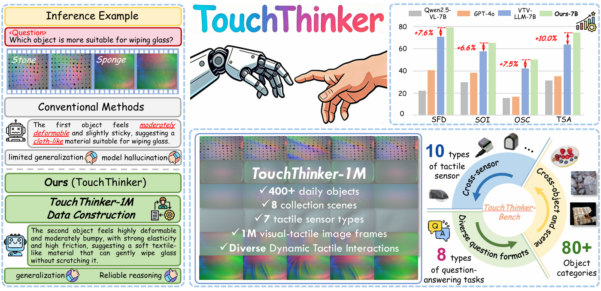
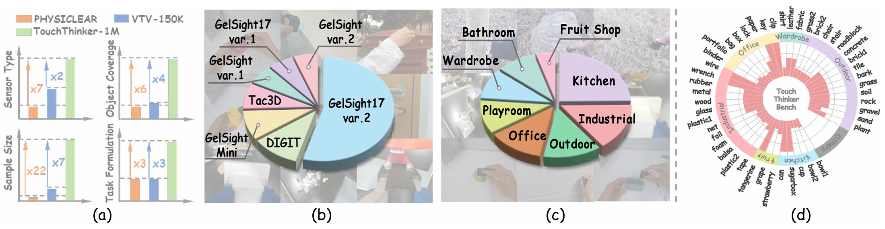
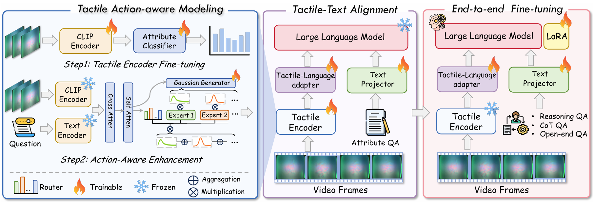

# TouchThinker: Scaling Tactile Commonsense Reasoning to the Open World with Large-scale Data and Action-aware Representation

The official implementation for **"TouchThinker: Scaling Tactile Commonsense Reasoning to the Open World with Large-scale Data and Action-aware Representation"**.

**Authors:** Kailin Lyu, Di Wu, Pengwei Zhang, Yuhang Zheng, Yingxin Lai, Long Xiao, Kangyi Wu, Pengna Li, Chen Gao, Lianyu Hu, Weihao Yuan, Xiaobin Hu, Jie Hao, Ce Hao, Shuicheng Yan

**Paper:** [[arXiv](http://arxiv.org/abs/2606.11637)]

**Dataset:** [[Hugging Face](https://huggingface.co/datasets/ckjs/TouchThinker)] [[Google Drive](https://drive.google.com/drive/folders/1OFsoainYEWkGbHkbilkMr3zOHPmLk-F-?usp=sharing)]

------

## Introduction

Touch is a key modality for embodied agents to understand the physical world. Although recent work has incorporated tactile signals into language systems for tactile commonsense reasoning, scaling such systems to realistic open-world settings remains challenging due to two key bottlenecks: existing tactile reasoning datasets remain limited in format and scale, and tactile signals are inherently redundant and action-specific.

To address these limitations, we propose **TouchThinker**, a tactile-language framework that scales tactile commonsense reasoning to the open world from both data and representation perspectives. First, we construct **TouchThinker-1M**, a million-scale, multi-source tactile reasoning dataset covering **415 objects**, **8 scenarios**, and **7 sensor types**, providing a solid data foundation for open-world generalization. We further introduce **TouchThinker-Bench**, an open-world benchmark with more realistic and diverse tasks.

On the representation side, TouchThinker introduces an **action-aware modeling mechanism** to improve tactile representation efficiency and enable efficient reasoning. Overall, TouchThinker expands tactile reasoning with large-scale data, action-aware representation, and multi-dimensional evaluation, achieving strong performance across multiple tactile reasoning tasks.

## TouchThinker-1M Dataset

**TouchThinker-1M** is built by integrating heterogeneous visual-tactile sources into a unified tactile reasoning format. We standardize tactile videos, unify attribute annotations across datasets, and organize tactile observations into semantically consistent question-answer supervision.

Beyond conventional template-based tactile question answering, TouchThinker-1M introduces two complementary formats: chain-of-thought tactile reasoning and open-ended tactile question answering. These formats encourage models to ground their responses in tactile evidence and connect physical observations with commonsense conclusions.

We further introduce **TouchThinker-Bench** for open-world evaluation. The benchmark is designed to test tactile property understanding, tactile commonsense reasoning, unseen-object generalization, and unseen-sensor generalization under more realistic and diverse task settings.

## TouchThinker Model

TouchThinker adopts an **action-aware tactile-language reasoning framework**. Since tactile signals are redundant and action-specific, the model first performs question-guided tactile token fusion to align tactile observations with task semantics.

Then, an **action-aware Gaussian temporal MoE** mechanism identifies query-relevant tactile segments and aggregates meaningful tactile evidence. This allows the model to focus on informative interaction moments, such as pressing for hardness, sliding for friction, and rotation for texture.

The training pipeline contains two stages: tactile-text alignment and end-to-end supervised fine-tuning. The first stage aligns tactile representations with the language model embedding space using attribute question-answering data. The second stage improves tactile commonsense reasoning with more complex instruction data, including reasoning question answering, chain-of-thought question answering, and open-ended question answering.
